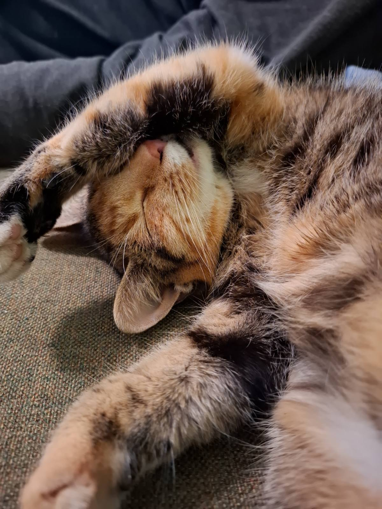

# HEYO! I'm Danilo.
**Developer | I can solder | CAD designer**

  
  

 
- I'm a beginner/intermidiate developer. 
- Currently studying computer engineering in high school. 
- I design PCBs. 

### Projects I'm working on

* **W-sense**
  - ESP32-C3 based soil moisture sensor.
  - sources: [github](https://github.com/DaniloAny/w-sense)

### What i know and use.

  <strong>Programming languages i know:</strong>  
  
   

  <strong>Programming tools:</strong>  
  
  
  

  <strong>CAD and 3D printing tools:</strong>  
  

### My devices

* Artemis (Desktop PC)
    * CPU: AMD ryzen 5 5600x
    * GPU: AMD RX 7600 GAMING OC 8G
    * RAM: kingston fury 16gb ram kit
    * SSD: silicon power a60 1TB m.2
    * OS: NixOS (unstable)
      
<!-- * Apollo (Laptop)
    * Model: Thinkpad T480
    * CPU: i7-8550U
    * GPU: intel integrated graphics 620 and Nvidia MX150 2GB
    * RAM: 8GB 2666Mz
    * SSD: 256GB m.2
    * UPGRADES: (none for now) -->
   

   
  <strong>cat corner</strong>
   
  
  

